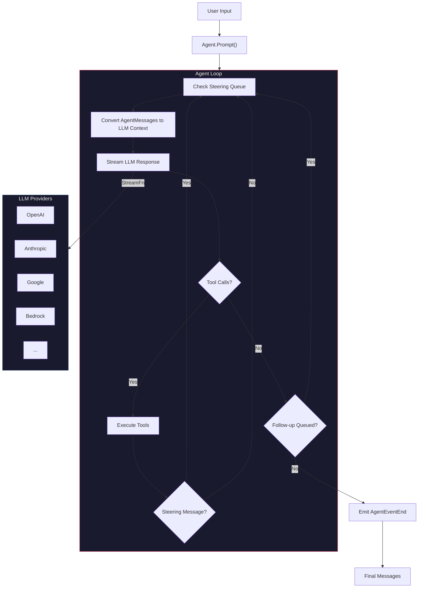

# Architecture

Pi-Mogo is a Go implementation of core components from the Pi Monorepo. It provides a unified multi-provider LLM API and an agent runtime with tool calling, streaming, and mid-conversation steering.

## Package Overview

```
pkg/
├── ai/       # Unified LLM abstraction layer
└── agent/    # Agent runtime with tool calling loop
```

### `pkg/ai` — LLM Abstraction

Normalizes interactions across 20+ LLM providers (OpenAI, Anthropic, Google, Bedrock, Groq, Mistral, etc.) behind a single streaming API. Key responsibilities:

- **Content & message types** — Union-based types with discriminator fields (`text`, `thinking`, `image`, `toolCall`) and three message roles (`user`, `assistant`, `toolResult`)
- **Model & provider registries** — Thread-safe global registries for models and API providers, allowing dynamic registration at runtime
- **Streaming** — Generic `EventStream[T, R]` built on Go channels, with `Stream`/`Complete` and `StreamSimple`/`CompleteSimple` entry points
- **Utilities** — Tool argument validation, streaming JSON parsing (handles incomplete payloads), context overflow detection, and environment-based API key resolution

### `pkg/agent` — Agent Runtime

Builds a multi-turn conversational agent loop on top of the LLM API. Key responsibilities:

- **Agent loop** — Outer loop processes follow-up messages; inner loop handles LLM calls, tool execution, and steering interrupts
- **Tool execution** — Sequential execution with argument validation, progress updates, and early exit on steering
- **Steering & follow-up queues** — Interrupt a running agent mid-turn or queue messages for after it finishes
- **Event system** — Observer pattern with fine-grained lifecycle events (agent start/end, turn start/end, message streaming, tool execution)
- **Proxy support** — Route LLM calls through a proxy server via SSE streaming

## Data Flow



## Extensibility

| Extension Point | Mechanism |
|---|---|
| Custom LLM provider | Implement `StreamFunction`, call `RegisterApiProvider()` |
| Custom tools | Define `AgentTool` with an `Execute` function |
| Context transformation | Supply `TransformContext` / `ConvertToLLM` in agent config |
| Event observation | `agent.Subscribe(fn)` for real-time lifecycle events |
| API key resolution | `config.GetApiKey()` for dynamic token management |
| Proxy routing | `StreamProxy()` for centralized LLM access |
